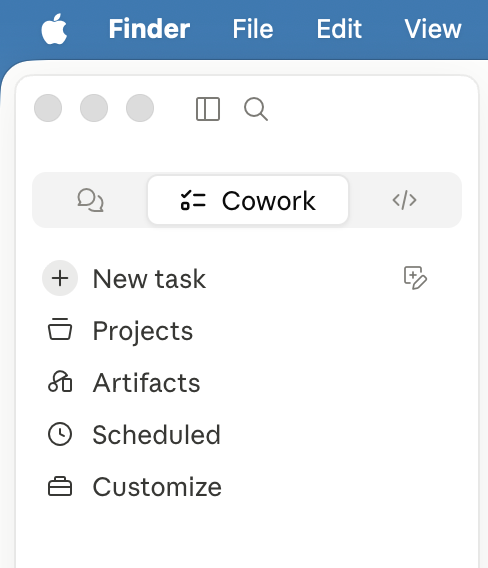
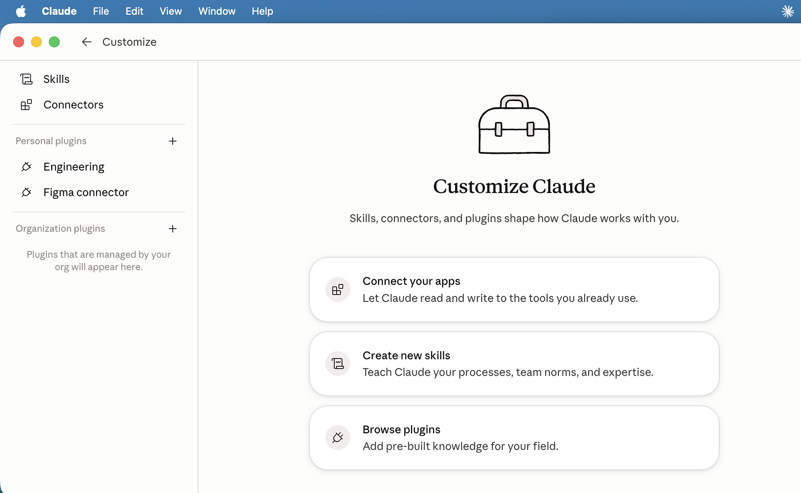
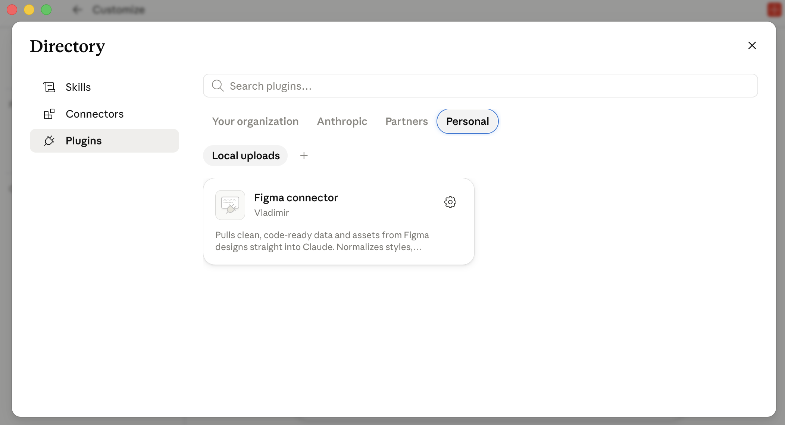
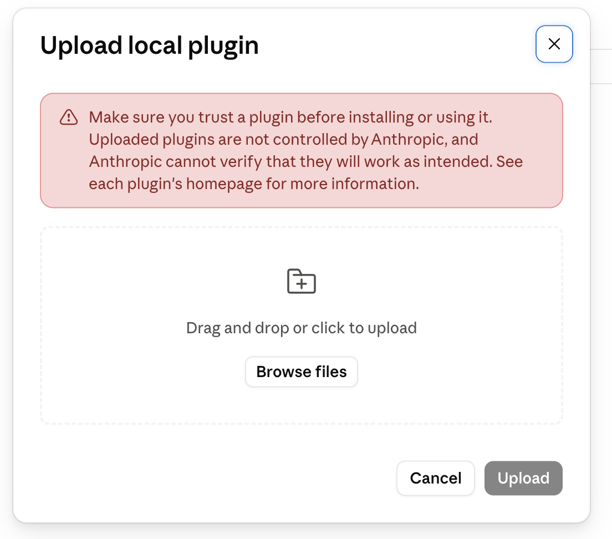

# Figma Connector

A Claude plugin that pulls **clean, code-ready data** from Figma straight into Claude — no console, no manual `curl`, no copy-pasting JSON.

It wraps the Figma REST API in a local MCP server that **normalizes** the response into a layout/tokens/components schema designed for writing markup, then exposes it to Claude as native tools. It also exports icons and images into your project.

## Why

The official Figma MCP and raw REST API return data that is either too shallow or too noisy to code from reliably. This connector replicates the proven "dump the file, then read it" workflow, but does the normalization and asset export for you, and lets Claude call it directly.

## What's inside

- **MCP server** (`mcp/server.js`) — zero dependencies, runs on Node 18+ (uses the built-in `fetch`).
- **Skill** (`skills/figma-to-code`) — teaches Claude a tokens → layout → assets workflow.

### Tools

| Tool | Purpose |
|------|---------|
| `figma_get_file` | Whole file as normalized JSON (layout, fills, typography, effects, components, tokens). Cached. |
| `figma_get_node` | Specific frames/nodes — cheap, for iterating screen-by-screen. |
| `figma_list_tokens` | Just the design tokens (variables + styles). |
| `figma_export_assets` | Render & download icons/images (SVG/PNG/JPG/PDF) into the project. |
| `figma_check_updates` | Detect whether the design changed since the last pull. |

## Installation

Install the `.plugin` file (from `build/`) as a local plugin in the Claude desktop app:

1. Open the **Cowork** menu → **Customize**.

   

2. On the Customize screen, choose **Browse plugins**.

   

3. In the Directory, open **Plugins**, select the **Personal** tab → **Local uploads**.

   

4. Click the **+** next to Local uploads and choose **Upload plugin**.

   

5. Drag the `.plugin` file into the dialog (or **Browse files**) and click **Upload**.

   

Then set your token (below) and you're ready.

## Setup

1. Create a Figma **personal access token**: Figma → Settings → Security → Personal access tokens. Give it at least *File content: read* (and *Variables: read* if on Enterprise and you want variable tokens).
2. Set the token — easiest via the token file (see below).

Optional environment variables:

- `FIGMA_ASSET_DIR` — where exported icons/images are written (default `./figma-assets`).
- `FIGMA_CACHE_DIR` — where normalized JSON is cached (default `~/.cache/figma-connector`). This is intentionally **outside your repo** — designs are not source.

### Setting the token

**Recommended — token file.** Save your token to a file the server reads automatically when the `FIGMA_TOKEN` env var is empty. This survives plugin updates and needs no config editing:

```bash
mkdir -p ~/.config/figma-connector
printf 'figd_your_token_here' > ~/.config/figma-connector/token
```

(You can also point `FIGMA_TOKEN_FILE` at a custom location.) Then restart Claude or reconnect the plugin.

> **Note:** In the desktop app, the connector's **Environment Variables** panel (Customize → Connectors → figma-connector) is currently **view-only** — you can see `FIGMA_TOKEN` there but not edit it. That's why the token file above is the recommended path. If you added the server manually (not via the `.plugin`), you can instead set `FIGMA_TOKEN` in `claude_desktop_config.json` (`Settings → Developer → Edit Config`) under `mcpServers → figma-connector → env`.

## Usage

Just share a Figma link with Claude: "code this screen" + a Figma URL. Claude will pull tokens, build the layout, and export assets. A `node-id` from the URL is used automatically to target a specific frame.

### Keeping in sync

Designs change. The cache tracks each file's `lastModified`.

- Manual refresh: ask Claude to "re-pull the design" — it calls `figma_get_file` with `refresh: true`.
- Automatic: ask Claude to set up a scheduled task that runs `figma_check_updates` (e.g. daily) and re-pulls + notifies you when the design changed.

## Notes & limits

- The **variables** API (`figma_list_tokens` → `tokens.variables`) is Figma **Enterprise-only**. On other plans the connector falls back to **style tokens** automatically.
- Asset export uses Figma's image-render endpoint; very large batches are rendered per request and downloaded sequentially.
- All network calls go only to `api.figma.com`. The token never leaves your machine.

## Development

```bash
# Quick protocol smoke test (no token needed):
printf '%s\n' \
  '{"jsonrpc":"2.0","id":1,"method":"initialize","params":{}}' \
  '{"jsonrpc":"2.0","id":2,"method":"tools/list"}' \
  | node mcp/server.js
```

License: MIT.
